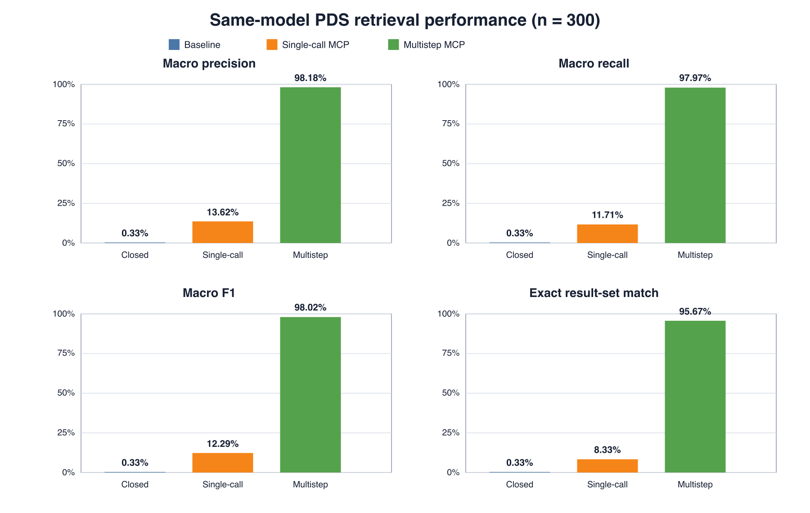
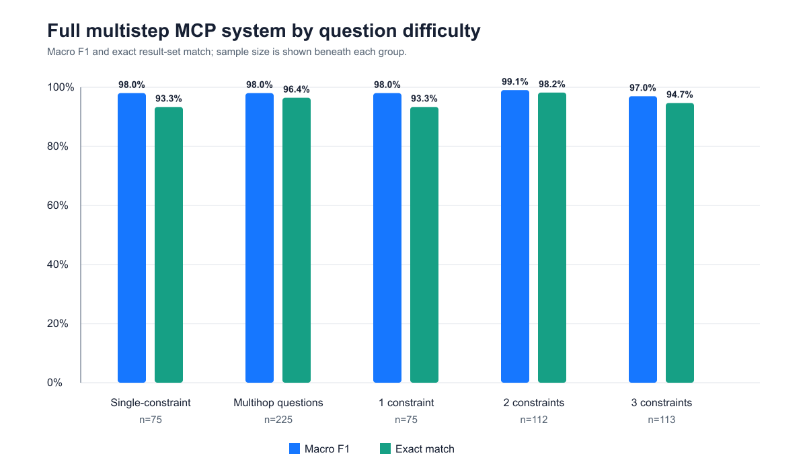
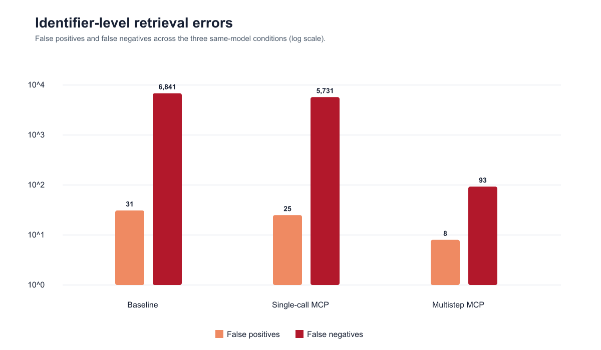
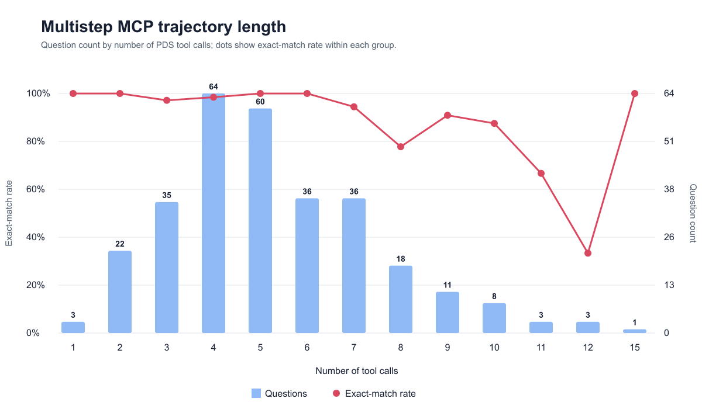

# Agentic Search for the NASA Planetary Data System

An MCP server and reproducible evaluation of multistep natural-language search
over the [NASA Planetary Data System (PDS) Registry](https://pds.mcp.nasa.gov/portal/) -- the digital data archive for all of NASA's planetary missions, flight and ground-based observations, and laboratory
experiments from the 1960s to the present. With more than **1.85 petabytes** from **70+
missions, 4,500 datasets, and 700 instruments** all peer-reviewed by JPL and other research institutions.

**[Evaluation study](#evaluation-study) · [Results](#results) · [Dataset](research/data/README.md) · [Data engine](src/pds_research/) · [Benchmark and reproducibility](#benchmark-and-reproducibility) · [MCP server](#mcp-server) · [Development guide](DEVELOPMENT.md)**

https://github.com/user-attachments/assets/1d6b7035-c07a-4ca3-8bd2-9c19d68c3d5c

## Abstract

The NASA Planetary Data System (PDS) serves as a high-quality, hand-curated data source for the whole community of planetary research. However, searching the PDS Registry is difficult, requiring knowledge of exact PDS4 ontology fields and context identifiers to manually construct queries for its public search APIs.  The research chain of scientific question -> experimentation -> findings/results is thus bottlenecked by current PDS search capabilities.

We introduce **PDS-MCP**, an agentic search interface on top of the NASA PDS Registry.
From natural language questions, our agent can iteratively resolve PDS entities, inspect relationships, construct valid filters, and retrieve matching products autonomously constructing PDS API queries with no manual human intervention. We evaluate this on our 300-question benchmark, constructed from our scalable data engine, with [results](#results) achieving **98.02% macro F1** and **95.67%
exact result-set match** on our full system, compared with 12.29% and 8.33% for single-call MCP and
0.33% on both metrics without PDS access, demonstrating that it can reliably bridge
natural-language questions and structured PDS retrieval.

By releasing **PDS-MCP** publically, we aim to support the researchers of the Planetary Data Science community by making it easier to access NASA PDS data. Our goal is to provide enhanced search capabilities that enable more effective data exploration and improve accessibility for future research endeavors.


## Evaluation study

### Research question

Can a language-model agent reliably translate natural-language planetary-data
requests into complete PDS Registry result sets, and does multistep MCP search
outperform the same model with one or zero PDS tool calls?

### Benchmark

The [benchmark dataset](research/data/main-300-live.jsonl) contains 300
independent questions:

| Dimension | Coverage |
|---|---:|
| Multihop questions with two or three context constraints | 225 |
| Single-constraint controls | 75 |
| Archive-collection retrieval questions | 294 |
| Context lookups | 6 |
| Target result-set size | 1–98 PDS identifiers |

### Data Engine

The complete [benchmark data engine](src/pds_research/) and its
[dataset documentation](research/data/README.md) are included in this
repository.

Ground truth was constructed as follows:

**Select compatible PDS context objects** → **Build a PDS API query** →
**Compile and execute it against the live PDS API** → **Save search results as target** → **Derive a natural-language questions as inputs**

For each benchmark item,
- **input**: the natural-language question
- **target**: the desired search results (from the intermediary PDS query)

Thus, the job of the agent run on the benchmark is to use the NLQ to build a PDS API query (without knowledge of the original one used in the data engine) and get the target search results.


### Conditions

| Condition | Model | PDS access | Purpose |
|---|---|---|---|
| Baseline | GPT-5.6 Luna | None | The same LLM without PDS-MCP or access to the PDS search interface. |
| Single-call MCP | GPT-5.6 Luna | At most one live MCP call | Tests whether tool availability without iterative search is sufficient. |
| **Multistep MCP (ours)** | GPT-5.6 Luna | Iterative live MCP calls | Tests entity resolution, refinement, and collection retrieval. |

## Results



| Condition | Macro precision | Macro recall | Macro F1 | Exact match | Micro F1 | Mean calls | Mean latency |
|---|---:|---:|---:|---:|---:|---:|---:|
| Baseline | 0.33% | 0.33% | 0.33% | 0.33% | 0.03% | 0.00 | 8.00 s |
| Single-call MCP | 13.62% | 11.71% | 12.29% | 8.33% | 27.85% | 1.01 | 29.86 s |
| **Multistep MCP (ours)** | **98.18%** | **97.97%** | **98.02%** | **95.67%** | **99.26%** | 5.28 | 47.24 s |

### Performance by difficulty


For multistep MCP system, performance remained high when
the full agent answered both single-constraint and multihop questions.
Two-constraint requests achieved the highest exact-match rate at 98.2%; the
three-constraint subset achieved 94.7%.

### Retrieval errors



The baseline and single-call conditions primarily failed by omitting relevant
identifiers. Multistep MCP reduced false negatives from 5,731 in the single-call
condition to 93 while producing only 8 false positives.

### Agent trajectory length



Most questions required between three and seven tool calls, with a median of
five. Exact-match rates at high call counts should be interpreted cautiously
because those groups are small and often contain harder or recovery-heavy runs.


## How multistep search works

A request such as:

> Find PDS collections from the New Horizons Kuiper Belt Extended Mission 1,
> collected by the Radio Science Experiment, targeting Arrokoth.

requires the agent to resolve several ontology objects before retrieving data:

1. Resolve the KEM1 investigation identifier.
2. Resolve the New Horizons REX instrument identifier.
3. Resolve Arrokoth and its PDS target identifier.
4. Search collections using the compatible investigation, instrument, and
   target constraints.
5. Return the complete normalized collection-identifier set.

This mirrors the work a user would otherwise perform manually when discovering
PDS4 context identifiers and exact Registry filters.

## Benchmark and reproducibility

Readers interested in the benchmark can start with the
[`research/data` guide](research/data/README.md). The underlying
[`pds_research` data engine](src/pds_research/) samples compatible PDS entities,
builds and validates typed query plans, executes live API requests, and writes
the resulting questions and target identifier sets.

| Artifact | Description |
|---|---|
| [`research/data/README.md`](research/data/README.md) | Dataset documentation and links to its construction pipeline. |
| [`main-300-live.jsonl`](research/data/main-300-live.jsonl) | Questions, typed query plans, API requests, ground-truth identifiers, difficulty labels, and provenance. |
| [`src/pds_research/`](src/pds_research/) | Benchmark-generation, validation, query-compilation, and evaluation code. |
| [`codex-baseline-main-300-gpt-5.6-luna.jsonl`](research/results/codex-baseline-main-300-gpt-5.6-luna.jsonl) | Raw baseline predictions from the LLM without PDS-MCP or PDS search access. |
| [`codex-live-single-call-main-300-gpt-5.6-luna.jsonl`](research/results/codex-live-single-call-main-300-gpt-5.6-luna.jsonl) | Raw single-call predictions. |
| [`codex-live-main-300-gpt-5.6-luna.jsonl`](research/results/codex-live-main-300-gpt-5.6-luna.jsonl) | Raw multistep predictions. |
| [`three-condition-comparison.csv`](research/results/three-condition-comparison.csv) | Graph-ready aggregate comparison. |
| [`three-condition-comparison.json`](research/results/three-condition-comparison.json) | Machine-readable metrics and resource measurements. |
| [`tool-call analysis`](research/results/codex-live-main-300-tool-call-analysis.csv) | Multistep hop-count distribution and exact accuracy by call count. |
| [`figures/`](research/results/figures/) | Headline, difficulty, retrieval-error, and trajectory-length figures in PNG and SVG formats. |
| [`generate_research_figures.py`](scripts/generate_research_figures.py) | Dependency-free script that regenerates the supporting SVG figures from committed metrics. |

Recompute identifier-set metrics with:

```bash
pds-research score \
  research/data/main-300-live.jsonl \
  research/results/codex-live-main-300-gpt-5.6-luna.jsonl
```

See [DEVELOPMENT.md](DEVELOPMENT.md) for environment setup, server execution,
MCP client configuration, and test commands.

## MCP server

The FastMCP server in [`src/pds_mcp_server.py`](src/pds_mcp_server.py) exposes
live PDS Registry operations for:

- Investigation, target, instrument-host, and instrument search.
- Context-product traversal.
- Collection search by investigation, target, instrument, and host.
- Detailed product retrieval by PDS identifier.

The server can be used from Claude Desktop, Cursor, Codex, or another
MCP-compatible host. Setup instructions are in [DEVELOPMENT.md](DEVELOPMENT.md).

## Example research queries

- Find Apollo 17 collections produced by the Lunar Surface Experiments Package
  Heat Flow Experiment and targeting the Moon.
- Find InSight collections produced by the Auxiliary Payload Sensor Subsystem
  temperature and wind sensor and targeting Mars.
- Find Cassini collections produced by the Imaging Science Subsystem Wide Angle
  camera and hosted on the Cassini Orbiter.
- Find New Horizons KEM1 radio-science collections targeting Arrokoth.

These examples are drawn from the released benchmark; the complete set is
available in [`main-300-live.jsonl`](research/data/main-300-live.jsonl).

## License

Code is released under the [MIT License](LICENSE).

## Support

- PDS Registry API: contact `pds-operator@jpl.nasa.gov` or open an issue in the
  [PDS API repository](https://github.com/NASA-PDS/pds-api).
- This server and study: open an issue in this repository.
